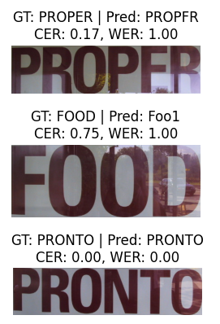

# End-to-End OCR Pipeline

This project implements an **end-to-end Optical Character Recognition (OCR) pipeline** that combines text detection and recognition on images using deep learning and open-source OCR libraries.

---

## 📌 **Project Overview**

✅ Detect text regions in images using the EAST model.  
✅ Crop and preprocess detected text regions.  
✅ Recognize text using two approaches:
- EasyOCR
- PyTesseract

✅ Evaluate the predictions using:
- Character Error Rate (CER)
- Word Error Rate (WER)

✅ Visualize results and analyze errors.

---

## 🔍 **Technologies & Libraries**

- Python
- OpenCV
- EasyOCR
- PyTesseract
- Matplotlib
- Google Colab

---

## 🚀 **Pipeline Steps**

### 1️⃣ Data Loading
- Mount Google Drive in Colab.
- Load images and corresponding ground truth annotation files.

### 2️⃣ Text Detection
- Use pretrained EAST model to detect text bounding boxes.
- Decode and apply non-max suppression to extract high-confidence boxes.

### 3️⃣ Cropping
- Use bounding boxes to crop text regions from the original image.

### 4️⃣ Text Recognition
- **EasyOCR** for recognition.
- **PyTesseract** for alternative recognition baseline.

### 5️⃣ Evaluation
- Compute CER (Character Error Rate) and WER (Word Error Rate) for predictions.
- Aggregate average metrics for comparison.

### 6️⃣ Visualization
- Display cropped regions with ground truth, prediction, CER, and WER.
- Highlight hardest cases (high CER) for error analysis.

---

## 📊 **Results & Comparison**

| Approach     | Detection Model | Recognition Model | Avg CER | Avg WER | Notes / Observations                     |
|---------------|-----------------|-------------------|---------|---------|------------------------------------------|
| EasyOCR       | EAST            | EasyOCR           | *0.306* | *0.667* | Best accuracy on our cropped images.     |
| PyTesseract   | EAST            | PyTesseract       | *0.444* | *0.450* | Slightly faster but worse on small text. |

---

## 🧪 **Example Visualization**

Example cropped regions with predicted vs ground truth text, and calculated CER/WER scores.

---

## ❗️ **Error Analysis**

- High CER/WER often observed on:
  - Very small or low-resolution text regions.
  - Stylized or warped fonts.
  - Blurry images.

- Suggested improvements:
  - Apply image preprocessing (thresholding, resizing).
  - Use better OCR models (e.g., trained CRNN, Transformers).
  - Fine-tune detection for rotated or curved text.

---

## ✅ **How to Run**

1️⃣ Open the Jupyter notebook in Google Colab.  
2️⃣ Mount your Google Drive.  
3️⃣ Set paths to your images and annotation text files.  
4️⃣ Run all cells.  

---

## ❤️ **Credits**

- EAST Text Detection Model
- EasyOCR library
- PyTesseract
- ICDAR Dataset (for ground truth annotations)

---
